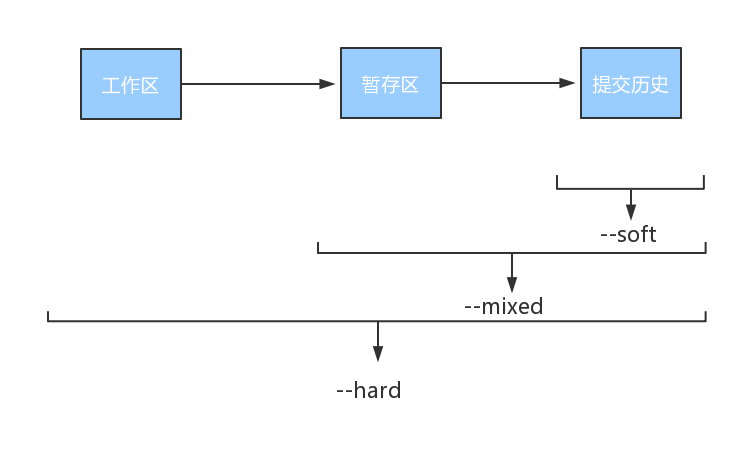
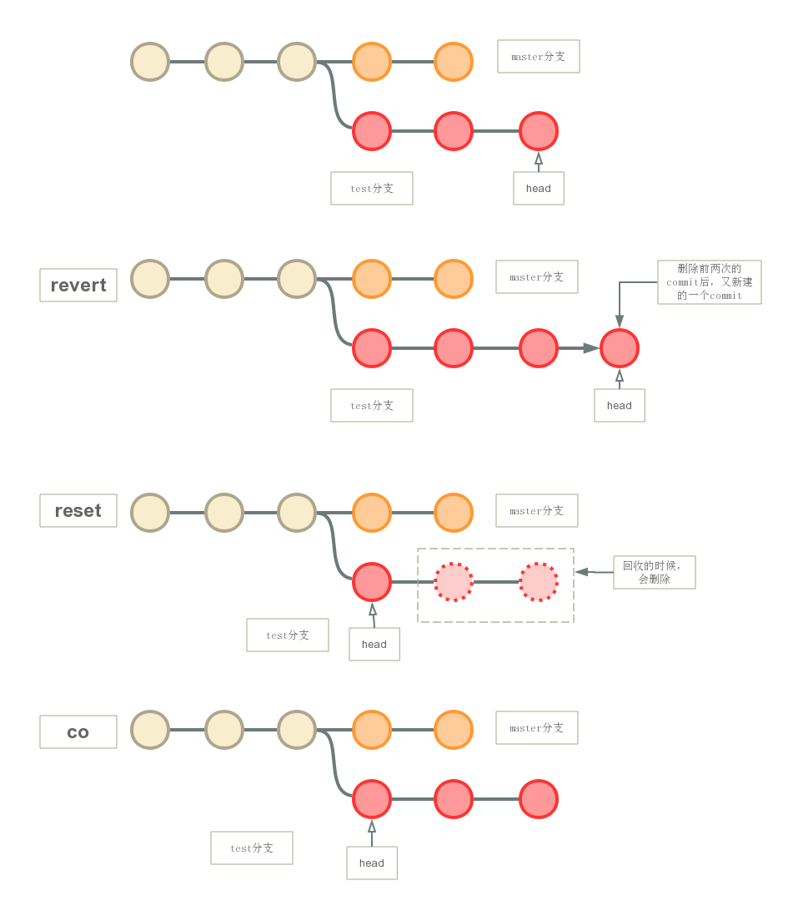

### 1 git reset
* 当git reset后没有文件名时，就是对commit的撤销。
* git reset撤销的commit，在下次git执行垃圾回收时，会被删除。
* git reset --mixed：默认方式，会回退到某个版本，只保留工作区，回退暂存区和提交历史信息
* git reset --soft：只回退了提交历史信息（即取消了commit的操作），直接commit即可提交。
* git reset --hard：彻底回退到某个版本，工作区也会变为上一个版本的内容，此命令慎用！

### 2 git checkout
* 无论是切换分支，还是撤销操作，git checkout移动的都是head。
* git checkout只是移动指针位置，所以并不会删除撤销的commit。

### 3 git revert
* git revert撤销某次或某几次commit时，会创建一个新的commit来撤销这些更改，它不会重写提交历史，用git log还能找到撤销的commit。
* git revert会重写工作区的文件，所以执行前会要求commit或add。
* git revert不能作用于具体的文件。
* 评价：安全的公用分支撤销命令。

### 4 git reset VS git checkout
* git reset <文件名>或git reset HEAD <文件名>：将暂存区中的指定文件回退到工作区，只是回退暂存区的修改，工作区不变，即撤销git add操作。
* git co -- <文件名>：放弃工作区的修改，还原指定文件或目录为当前版本库中的状态。

### 5 git reset VS git revert
* git revert是用一次新的commit来回滚之前的commit，git reset是直接删除之前的commit。
* git reset 是把HEAD向后移动了一下，而git revert是HEAD继续前进，只是新的commit的内容和要revert的内容正好相反，能够抵消要revert的内容。

### 6 对比图

