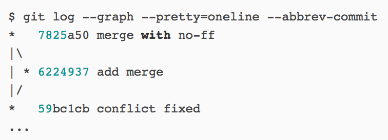

### 1 Fast forward模式
当条件允许时，Git直接把HEAD指针指向合并分支的头，完成合并，但这种模式下，删除分支后，会丢掉分支信息，因为在这个过程中没有创建commit。

### 2 no-ff模式
若强制禁用Fast forward模式，Git就会在merge时生成一个新的commit，这样从分支历史上就可以看出分支信息：
* git checkout -b dev
* git add <filename>
* git commit -m "add merge"
* git checkout master
* git merge --no-ff dev

默认的commit注释为：Merge branch 'dev' into master。可以通过加上-m参数，把commit注释写进去：
* git merge --no-ff -m "merge with no-ff" dev

通过git log命令查看分支历史：
* git log --graph --pretty=oneline --abbrev-commit

