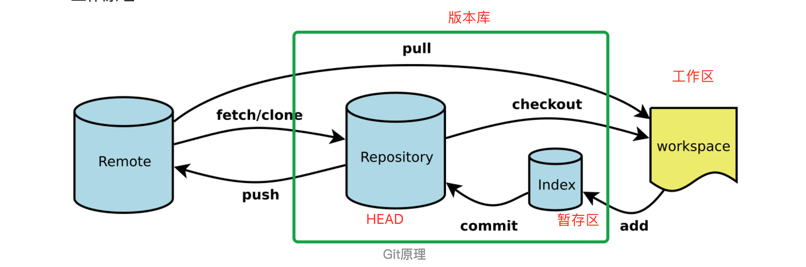

### 1 git的三个工作目录
* 工作区：.git所在的目录下，coding的区域
* 暂存区：一般存放在.git目录下的index文件中
* 版本库：工作区的隐藏目录.git



### 2 跟踪文件
#### 2.1 跟踪文件
* Git不会自动跟踪文件，使用命令git add开始跟踪一个新文件。

#### 2.2 不跟踪文件
* 一般总会有些文件（通常都是些自动生成的文件，如日志文件，或编译过程中创建的临时文件等）无需纳入Git的管理，也不希望它们总出现在未跟踪文件列表，可以创建一个名为.gitignore的文件，列出要忽略的文件模式。

#### 2.3 .gitignore配置语法
* 以\*通配多个字符
* 以?通配单个字符
* 以\[]包含单个字符的匹配列表
* 以!表示跟踪匹配到的文件或目录

#### 2.4 .gitignore配置规则
* dir/\*：不跟踪目录dir下的全部内容，包括根目录下的dir目录，还包括任何子目录下的dir目录。
* /dir/\*：不跟踪根目录下的dir目录。

#### 2.5 .gitignore文件示例
```
.idea
.DS_Store
*.log
*.sw[op]
logs
node_modules
public
.webpack-hmr-records.json
```
