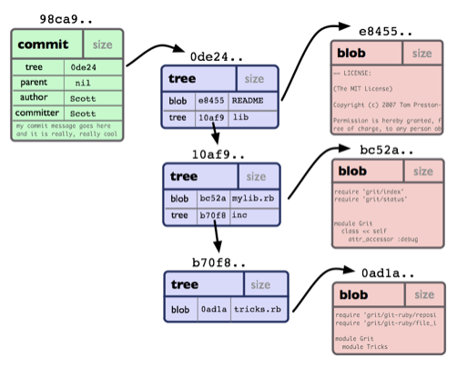
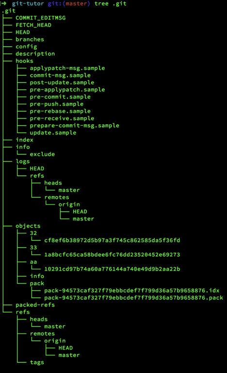
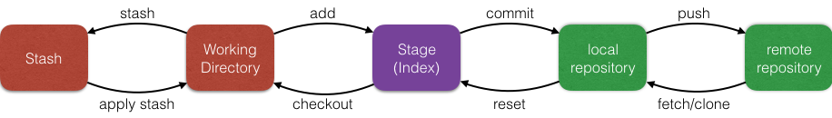

[<< 回到主页](http://suzy1993.github.io/misszy/)

## git 综述

### 1 git底层原理
#### 1.1 git
git保存的不是文件差异或者变化量，而只是一系列文件快照。

#### 1.2 git对象模型


#### 1.2.1 对象名
在git系统中，每个git对象都有一个特殊的ID来代表这个对象，这个特殊的ID就是SHA1哈希值。SHA1哈希值是通过SHA1算法计算出来的哈希值，对于内容不同的对象，会有不同的SHA1哈希值。commit id就是一个SHA1哈希值。
对象名是一个40bit的字符串，前2位是文件夹名称，后38位作为对象文件名：6ff87c4664981e4397625791c8ea3bbb5f2279a3
每一个对象名都是对对象内容做SHA1哈希计算得来的。
使用git保存文件的优点是相同的文件只会保存一份，也就是说，内容相同的文件具有相同的对象名，只会存储一份。

#### 1.2.2 git对象模型的类型
在git系统中，有4种类型的对象，所有的git操作都是基于这四种类型的对象来进行的。
* blob：存储文件数据，用来保存文件的内容，类比文件。
* tree：对象关系树，管理tree和blob，类比目录。
* commit：指向一个tree，用来标记项目某一个特定时间点的状态。
* tag：标记某一个commit。




查看git对象的内容：
```
git cat-file -p 6ff87c4664981e4397625791c8ea3bbb5f2279a3
```
tree命令可以查看.git目录下的git对象信息：



#### 1.3 git存储
git存储和常用操作：



### 2 git实践
#### 2.1 git本地操作
#### 2.1.1 add
添加文件内容到暂存区

#### 2.1.2 commit
将变化记录到仓库


#### 2.1.3 reset
重置当前的HEAD指针到具体的状态
从Stage(Index)的角度看，reset是add的逆操作。
模式：soft | mixed | hard | merge | keep
#### 2.1.3.1 reset commit
git reset要慎用，因为回退到某一次commit后，在其之前的commit将没法再获取到。
git reset --hard更要慎用，若不小心git reset --hard了，在还没触发垃圾回收的情况下可以有一次补救机会，但若已经垃圾回收了，就没法补救了。
```
git reset HEAD~3 # 等价于 git reset --mixed HEAD~3
```

```
git reset --soft HEAD~3
```

```
git reset --hard HEAD~3
```

```
git reset # 等价于 git reset HEAD
```


#### 2.1.3.2 reset file
```
git reset [HEAD~2] [--] filename
```


#### 2.1.4 checkout
切换分支或存储工作树文件
#### 2.1.4.1 checkout branch
```
git checkout dev
```


问题：本地有修改但未提交的文件，可否切换分支？  
解答：不一定，若两个分支都修改了同一个文件，而当前分支对该文件的修改未提交，则会出现冲突，需要先处理冲突。

#### 2.1.4.2 checkout commit
```
git checkout master~3
```


问题：执行git checkout master~3后，HEAD不是先指向分支名，然后再指向commit，而是直接指向commit，若此时在此commit基础上做了修改再提交，新得到的commit将没有任何一个指针指向它，以后没法追踪。  
解决方法：在git checkout master~3之后新建一个分支再做修改和提交。

#### 2.1.4.3 checkout file
```
git checkout master~3 [--] file
```

```
git checkout — file #省略commit，则从Stage(Index)中取文件
```


#### 2.2 git远程操作


#### 2.2.1 clone
克隆一个仓库到新的目录
```
mkdir 'git-tutor'
create remote-tracking branches
create and checkout an initial branch
```

#### 2.2.2 push
更新远程的refs以及关联的objects
```
git push [<repository>] [<localbranch>][: <remotebranch>]
```

#### 2.2.3 remote
管理跟踪仓库的集合

#### 2.2.4 fetch
从另一个仓库下载objects和refs
```
config remote-tracking branches
```

#### 2.2.5 pull
下载或集成另一个仓库或一个本地分支（pull = fetch + merge）
```
git fetch [options]
git merge/rebase FETCH_HEAD
```
问题：git fetch origin master:master与git fetch origin master有什么区别？  
解答：git fetch origin master只会更新远程master而不会更新本地master，git fetch origin master:master才会更新本地master。

#### 2.3 git合作
#### 2.3.1 merge
合并两个或更多的开发历史
```
git merge master
```
#### 2.3.1.1 fast-forward


#### 2.3.1.2 no change


#### 2.3.1.3 true merge


#### 2.3.2 rebase
在另一个基线上重新申请commit
```
git rebase master [dev]
```


#### 2.3.3 cherry-pick
应用一些现有的提交引入的更改
```
git cherry-pick 2c33a
```


#### 2.3.4 revert
恢复一些现有的commit
```
git revert b325c
git revert -n master~4..master~1 #丢弃从最近的第4个commit（包含）到第1个commit（不包含），一次revert多个commit，左闭右开
```


#### 2.4 git debug
#### 2.4.1 log
显示commit logs
```
git log --follow -p -- file
```

#### 2.4.2 diff
显示commits之间的差异，如comiit何工作树
```
git diff
```

```
git diff --cached
```

```
git diff HEAD
```

```
git diff dev
```

```
git diff b325c da985
```


#### 2.4.3 reflog
管理reflow信息
git reflog显示整个本地仓储的commit，包括所有branch的commit，甚至在还没触发垃圾回收的情况下可以看到已经撤销的commit，不小心git reset --hard了可以有一次补救机会，但若已经垃圾回收了，就没法补救了。

#### 2.4.4 grep
打印匹配模式串的行

#### 2.4.5 blame
显示文件的每一行最后修改的版本和作者

#### 2.4.6 clean
清除工作区中的untracking files
```
git clean -d | -x | -f | -n
```

### 3 git工作流


### 4 参考
《Pro Git》  
《Git Internals》  
[http://ndpsoftware.com/git-cheatsheet.html]()  
[http://marklodato.github.io/visual-git-guide/index-en.html]()  
[http://www.ruanyifeng.com/blog/2015/12/git-cheat-sheet.html]()  
[http://www.liaoxuefeng.com/wiki/0013739516305929606dd18361248578c67b8067c8c017b000]()  
[https://stackoverflow.com/questions/4084921/what-does-the-git-index-contain-exactly]()  

[<< 回到主页](http://suzy1993.github.io/misszy/)
