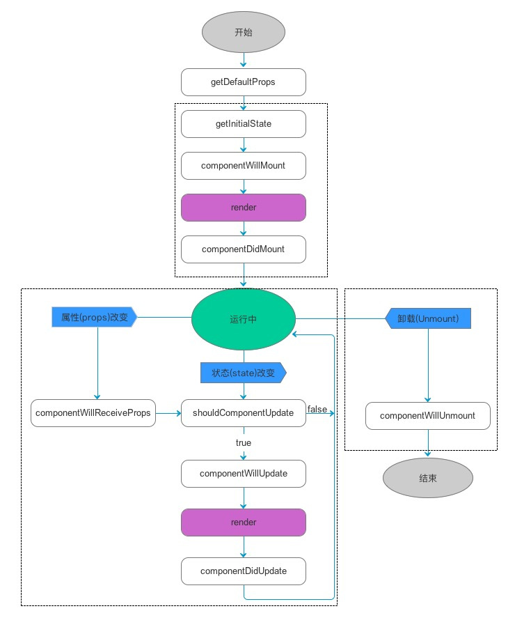

[<< 回到主页](http://suzy1993.github.io/misszy/)

## React生命周期

### 1 React生命周期流程图

### 2 组件在发生不同变化时会执行哪些生命周期方法？

### 3 每个生命周期方法适合做什么？
#### 3.1 getDefaultProps()
* 此方法用于设置组件类默认的props，一般用于顶级组件。
* 由于props在所有实例中共享，因此此方法对于组件类来说只调用一次，该组件类的所有后续实例将不会再调用，也即，当再次渲染时，不会再调用此方法。

#### 3.2 getInitialState()
* 此方法用于为每个组件实例设置初始的state。
* 由于state只存在于组件的内部，因此此方法对于每个组件实例来说都会调用，且只调用一次，当再次渲染时，需要调用此方法。
* getDefaultProps方法只在首次创建实例时被调用，而getInitialState在每次创建实例时都会被调用。调用getInitialState方法时，已经可以访问this.props。

#### 3.3 componentWillMount()
* 此方法在首次渲染前被调用。
* 此方法是在render方法调用之前修改state的最后一次机会。

#### 3.4 componentDidMount()
* 此方法在组件实例化后被调用。
* 此方法调用后，已经渲染出真实的DOM，可以在方法内部通过this.getDOMNode()访问到它。对DOM节点的初始化应该放在这里。
* 要获取对组件的引用，需要用到ref属性，这对于原生HTML足以获取到真实DOM，但对于React Component，在通过ref属性获取对组件的引用的基础上，还需通过ReactDOM.findDOMNode()方法才能访问到真实的DOM。
* 在此方法中，可以进行以下操作：
* Preparing timers
* Fetching data
* Adding event listeners

#### 3.5 componentWillReceiveProps(nextProps)
* 当组件将要接收新的props时，此方法被调用，可以修改props和更新state。
* 此方法的参数是新的props，在此方法中可以比较函数参数和this.props，进行更新state的操作。

#### 3.6 shouldComponentUpdate(nextProps, nextState)
* 当组件已经接收到新的props和state时，此方法被调用。
* 此方法用于判断是否需要更新DOM结构，其参数是新的props和新的state，在此方法中可以分别比较函数参数和this.props、this.state，如果确定组件或其任何子组件不需要重新渲染，则该方法返回false，跳过此次更新，不再执行后续的componentWillUpdate、render和componentDidUpdate方法。
* 此方法用于在组件渲染时进行精确优化。
* 此方法非必须，且大部分情况没有必要使用，不恰当的使用可能会影响程序运行，应该在确认性能瓶颈后合理使用，达到精确渲染的目的。

#### 3.7 componentWillUpdate(nextProps, nextState)
* 此方法在组件接收到新的props或state后，render()方法之前。

* 注意：不可以在此方法中更新state或props，而应借助componentWillReceiveProps方法更新state。
8）componentDidUpdate(prevProps, prevState)
* 此方法在组件更新后被调用。
* 此方法调用后，DOM已经更新，可以访问并修改DOM，如添加事件。
9）componentWillUnmount()
* 此方法在组件被卸载和销毁前被调用。
* 在此方法中，完成所有的清理和销毁工作，如释放内存、图片资源等。
* 在componentDidMount中添加的任务都需要在此方法中撤销，如：
* Clearing timers
* Removing event listeners
* Stopping sockets
* Cleaning up redux states
 
[<< 回到主页](http://suzy1993.github.io/misszy/)
