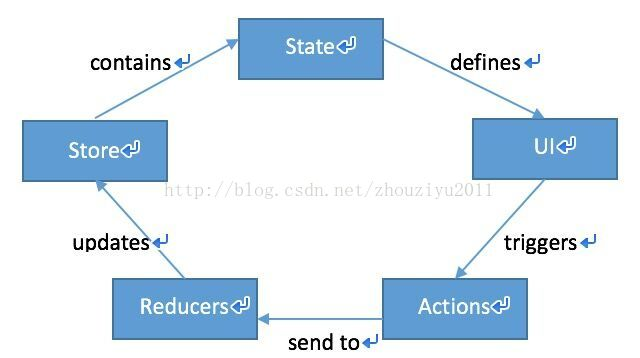
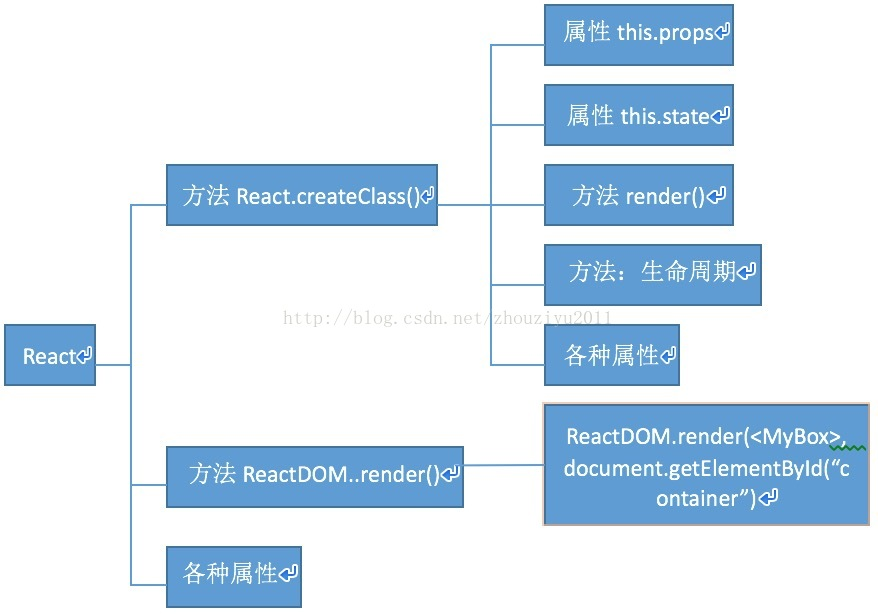
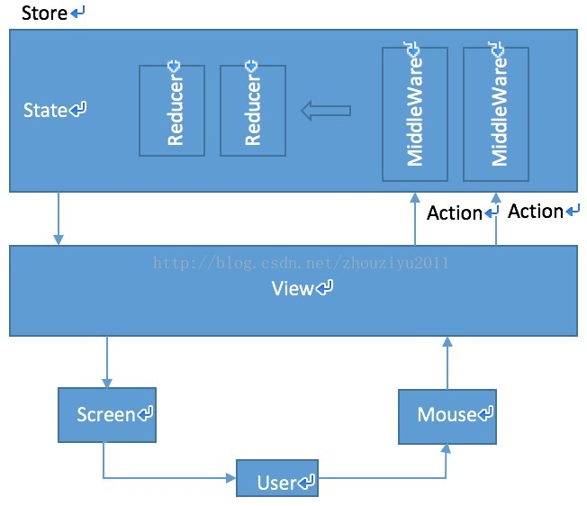
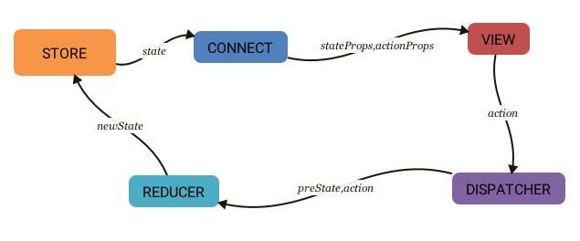

[<< 回到主页](http://suzy1993.github.io/misszy/)

## React Redux

### 1 数据流
#### 1.1 数据流是什么？为什么要用数据流？
#### 1.1.1 数据流是行为与响应的抽象。
用户在页面上输入表单、按下按钮、拖拽等行为，页面会根据用户的行为给出一些响应，如刷新、跳转、局部刷新、Ajax局部刷新、数据更新等。以对象、方法来把它们抽象出来，这就是数据流。

#### 1.1.2 使用数据流可以帮助我们明确行为以及行为对应的响应。
这与React的目标——状态图预测是密不可分的。

#### 1.2 React与数据流的关系：
React是纯V的框架，只负责视图，把视图做成了组件化，不涉及任何的数据和控制，需要数据流进行支撑才能完成一个完整的前端项目。

#### 1.3 主流的数据流框架有哪些？为什么使用Redux？
#### 1.3.1 Flux
Facebook在推出React时推出了一套官方适配的、配合React来实现的数据流，现在是一种单项数据流或单向数据绑定的思想，但它非常重、非常大、实用性不太强，因此很多人做了很多改进，出现了很多第三方的数据流框架，比较出名的有reFlux和Redux。

#### 1.3.2 reflux
#### 1.3.3 Redux
在很多第三方数据流框架中有一些优势：一是非常简单；二是它维护了一棵单一的状态树。

#### 1.4 单向数据流：
#### 1.4.1 MVC
数据放在Model里，View来控制显示，Controller来做整体的管理。
随着系统的庞大，会产生一些问题：交互时，当用户有一个Action时，这个Action会分发到各个Model，如：上网shopping，提交订单这一个动作会分解到有一条订单要记录下来、用户账户会发生变化、优惠信息会发生变化，物流信息会发生变化，会影响库存等。这么多Model都要更新，更新后页面上的多个View也会跟着变化，互相之间也会有影响，可能系统的状态会变得不可预测，不知道下单后页面会发生什么变化。

#### 1.4.2 Flux
用户会有各种各样的Action（行为），所有的行为由一个统一的Dispatcher去分发，一个Action只能分发到若干个Store里面，Store保持着数据，也保存着当前页面的状态，根据用户的行为以及页面当前的状态，一个Store只能向视图层传递信息，不允许视图层反回来作用在Store上，视图就会发生变化，再由用户去传入新的Action，这样数据的流向是单向的。

### 2 Redux概述
Redux是JavaScript 状态容器，提供可预测化的状态管理。
Redux其实是Flux框架的一种实现方法。Redux与Flux的思想有点不同。
大概的过程：当一个页面渲染完后，UI出现，用户其实是触发了UI上的一些Action，Action将会被送到Reducers方法里，Reducers将会更新Store，数据就是React开发中的State，State其实是Store的一部分，所有的视图层的东西，也就是组件，其实是由State来唯一决定的。

### 3 React概述
React可以认为有以下三部分组成：
#### 3.1 React.createClass()：创建一个React组件
* 属性this.props用于父子组件之间传递属性；
* 属性this.state用于表示组件本身的状态，当state变化时，该组件会根据最新的state正确渲染出来；
* 方法render()中定义组件渲染成什么样子，应该是怎么样的一种呈现，在其中写JSX；
* 方法需要了解生命周期。

#### 3.2 ReactDOM.render()：把组件（包括嵌套组件）渲染到页面的某个节点上。
ReactDOM是在0.14版本之后才拆出来的，在之前是只有React，统称为React。

#### 3.3 各种属性
一般不怎么用到，在此不作叙述。

### 4 react-redux
#### 4.1 安装
#### 4.1.1 安装命令：
npm install react-redux redux

#### 4.1.2 安装两个包：
* redux自身是一个独立的工作流；
* react-redux是redux的react绑定，也就是说，利用react来实现了redux。

#### 4.2 react-redux框图

  
User的单击鼠标等动作其实是作用在View层上，也就是组件渲染出来的页面上，页面会渲染出Action，这些Action被传到Store中，Store里面的MiddleWare是它的一些中间件，实际上这些Action最终是作用在Reducer上的，也就是响应，reducer决定了当前state和Action结合起来后state会发生什么变化，然后state变化后再反过来作用在View层上，也就是组件上，组件就会重新渲染后呈现在页面上。

#### 4.3 react-redux提供两个关键模块：Provider和connect
#### 4.3.1 Provider
Provider作为整个App的容器，在原有的App Container的基础上再包上一层，它的工作就是接受Redux的store作为props，并将其声明为context的属性之一，子组件可以在声明了contextTypes之后可以方便地通过this.context.store访问到store。不过组件通常不需要这么做，将store放在context里，是为了给connect用的。

#### 4.3.2 connect
connect真正意义上连接了Redux和React。
Redux的运作：store中维护了一个state，dispatch一个action，接下来reducer根据这个action更新state。
一个React组件作为View层，做两件事：render和响应用户操作。connect将store中的必要数据作为props传递给React组件来render，并包装action creator用于在响应用户操作时dispatch一个action。

#### 4.4 react-redux项目结构
#### 4.4.1 几个文件和文件夹
* actions：存放Action，用户的行为。
* components：展示组件。
* containers：容器组件。
* reducers：Store里负责分发用户的行为，根据不同的行为作出不同的响应。
* index.html：母版文件，最终最顶层的组件需要渲染到一个DOM节点上，这需要一个HTML模板来实现，这个模板放在index.html中。
* index.js：项目的跟入口文件。
* server.js：把真个该项目跑起来，包括对其的构建。
* webpack：需要一个webpack的打包配置文件。

#### 4.4.2 action
* action是行为的抽象。
* action本质上就是一个JS对象。
* action必须使用一个字符串类型的type字段来表示将要执行的动作，一般为字符串常量，type是唯一的。
* action一般由方法来生成。

#### 4.4.3 reducer
* reducer是响应的抽象。
* reducer必须是一个纯方法，也就是可以完全根据输入得到输出（非纯方法可能依赖当前时间、系统状态等）。
* reducer用于更新state，传入的是旧状态和action，返回新状态。

#### 4.4.4 store
* action其实不是直接作用于reducer，而是作用于store上。
* reducer其实是根据store来作出响应，store其实是state加上reducer的混合体，也就是数据和状态的存储。
* store是唯一的，也就是唯一状态树。
* store包括了完整的state，也即项目的整个状态。
* store完全可预测，也即能想象到发生不同action时state将发生什么样的变化。
* 连接action和reducer的对象且唯一，有如下职责：
    * 维持state对象。
    * 提供getState()方法获取state。
    * 提供dispatch(action)方法更新state。
    * 通过subscribe(listener)方法注册监听。

#### 4.4.5 组件
React写的都是组件，但引入数据流以后，把组件分成两类：一类是container，另一类是component。
<table>
    <tr><td></td><td>container</td><td>component</td></tr>
    <tr><td>目的</td><td>如何工作（如何获取数据，状态如何更新）</td><td>如何显示（样式，布局）</td></tr>
    <tr><td>是否在Redux数据流中</td><td>是，Redux知道container存在，因为reducer根据用户的action决定如何响应后，就是作用于container上的</td><td>否，Redux并不知道component存在</td></tr>
    <tr><td>读取数据</td><td>从Redux获取state，即当行为导致store发生变化时，旧的state加上action得到新的state，container读取新的state决定自己怎么变化</td><td>只能从props获取数据，数据都是其父组件提供的</td></tr>
    <tr><td>修改数据</td><td>向Redux派发actions</td><td>只能是父组件给其props传递一个回调函数，component只是从props调用回调函数</td></tr>
    <tr><td>实现方式</td><td>由react-redux生成</td><td>手写</td></tr>
</table>

#### 4.5 react-redux数据流

* store维护单一的state对象，在容器组件中通过connect函数返回state和dispatch作为prop传递给展示组件。
* 当组件事件触发，通过bindActionCreators函数将actionCreators传给dispatch(),发起一次dispatch过程。
* store将prevState和action两个参数输入reducer，返回新的state，最后重新render。

#### 4.6 react-redux优点
* 方便调试：能在redux-dev-tool看到所有state和action的变化。
* 状态容器：解决了react的props不能跨components传递的问题。
* state和props选取：不用考虑react下数据模型哪些作为props，哪些作为state的问题。
* 流程规范，统一渲染根节点，只要有需要显示数据的组件，当相关数据更新时都会自动进行更新。
* 减少手动编码量，提高编码效率。

#### 4.7 react-redux缺点
* 一个组件所需要的数据，必须由父组件传过来，而不能像flux中直接从store取。
* 当一个组件的相关数据更新时，即使父组件不需要用到这个组件，父组件还是会重新render，这可能会有效率影响的问题。

[<< 回到主页](http://suzy1993.github.io/misszy/)
