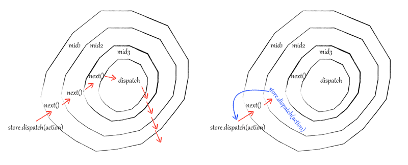

### 参考网址
[http://cn.redux.js.org/docs/advanced/Middleware.html](http://cn.redux.js.org/docs/advanced/Middleware.html)
[https://segmentfault.com/a/1190000004485808](https://segmentfault.com/a/1190000004485808)
[https://segmentfault.com/a/1190000006149647?utm_source=tuicool&utm_medium=referral](https://segmentfault.com/a/1190000006149647?utm_source=tuicool&utm_medium=referral)
[https://segmentfault.com/a/1190000003746223](https://segmentfault.com/a/1190000003746223)

### 1 redux的源代码由五部分组成
* createStore.js
* applyMiddleware.js
* bindActionCreators.js
* combineReducers.js
* compose.js

### 2 redux的核心：
（FP）函数式编程思想（reducers的设计、curry编程风格等）

### 3 什么是middleware？
在redux里，middleware是发送action和action到达reducer之间的第三方扩展，也就是中间层。也可以说，middleware是架在action和store之间的一座桥梁。

### 4 为什么要引入middleware？
如果当应用中每一个action被发起以及每次新的state被计算完成时都将它们记录下来，那么当程序出现问题时，可以通过查阅日志找出是哪个action导致了state不正确。
#### 4.1 手动记录
最直接的解决方案就是在每次调用store.dispatch(action)前后手动记录被发起的action和新的state。这称不上一个真正的解决方案，仅仅是理解这个问题的第一步。
实例：
```
store.dispatch(addTodo(‘React Redux’));
```
为了记录该action以及新的state，可以通过这种方式记录日志：
```
let action = addTodo('React Redux');
console.log('Dispatching：', action);
store.dispatch(action);
console.log(‘New state：', store.getState());
```
面对多种多样的业务需求，单纯的修改dispatch或reducer的代码显然不具有普适性，需要的是可以组合的，自由插拔的插件机制，另外reducer更关心的是数据的转化逻辑，所以redux的middleware是为了增强dispatch而出现的。

#### 4.2 封装dispatch
将上述操作抽取一个函数：
function dispatchAndLog(store, action) {
    console.log('Dispatching：', action);
    store.dispatch(action);
    console.log('New state：', store.getState());
}
dispatchAndLog(store, addTodo('React Redux'));

#### 4.3 实现dispatch的monkeypatch（给内置对象扩展方法）
直接替换store实例中的dispatch函数：
```
let next = store.dispatch;
store.dispatch = function dispatchAndLog(action) {
    console.log('Dispatching：', action);
    let result = next(action);
    console.log('New state：', store.getState());
    return result;
}
```

#### 4.4 隐藏monkeypatch
monkeypatch本质上是一种hack：“将任意的方法替换成你想要的”。
不是用自己的函数替换掉store.dispatch，而是在函数中返回新的dispatch：
```
function logger(store) {
    let next = store.dispatch;
    return function dispatchAndLog(action) {
        console.log('Dispatching：', action);
        let result = next(action);
        console.log('Next state：', store.getState());
        return result;
    }
}
```
可以在Redux内部提供一个可以将实际的monkeypatch应用到store.dispatch中的辅助方法：
```
function applyMiddlewareByMonkeypatching(store, middlewares) {
    middlewares = middlewares.slice();
    middlewares.reverse();
    // 在每一个middleware中变换dispatch方法
    middlewares.forEach(middleware => store.dispatch = middleware(store));
}
```
应用多个middleware：
```
applyMiddlewareByMonkeypatching(store, [ logger, ... ]);
```
实现方式依旧是monkeypatch，因为仅仅是将它隐藏在框架内部，并没有改变这个事实。

#### 4.5 移除monkeypatch
为什么要替换掉store.dispatch？这样就可以在后面直接调用它，但还有另一个原因是：每一个middleware都可以操作（或者直接调用）前一个middleware包装过的store.dispatch：
```
function logger(store) {
    // 这里的next必须指向前一个middleware返回的函数
    let next = store.dispatch;
    return function dispatchAndLog(action) {
        console.log('Dispatching：', action);
        let result = next(action);
        console.log('Next state：', store.getState());
        return result;
    }
}
```
将middleware串连起来的必要性是显而易见的。
如果applyMiddlewareByMonkeypatching方法中没有在第一个middleware执行时立即替换掉store.dispatch，那么store.dispatch将会一直指向原始的dispatch方法。也就是说，第二个middleware依旧会作用在原始的 dispatch 方法。
但是，还有另一种方式来实现这种链式调用的效果。可以让middleware以方法参数的形式接收一个next()方法，而不是通过store的实例去获取：
```
function logger(store) {
    return function wrapDispatchAndLog(next) {
        return function dispatchAndLog(action) {
            console.log('Dispatching：', action);
            let result = next(action);
            console.log('Next state：', store.getState());
            return result;
        }
    }
}
```
这些串联函数不太合理，ES6的箭头函数可以使其柯里化 ，看起来更舒服一些：
```
const logger = store => next => action => {
    console.log('Dispatching：', action);
    let result = next(action);
    console.log('Next state：', store.getState());
    return result;
}
```
middleware接收了一个next()的dispatch函数，并返回一个dispatch函数，返回的函数会被作为下一个middleware的 next()，以此类推。由于store中类似getState() 的方法依旧非常有用，将store作为顶层的参数，使得它可以在所有middleware中被使用。


#### 4.6 单纯地使用middleware
可以写一个applyMiddleware()方法替换掉原来的applyMiddlewareByMonkeypatching()。在新的applyMiddleware()中，取得最终完整的被包装过的dispatch()函数，并返回一个store的副本：
```
function applyMiddleware(store, middlewares) {
    middlewares = middlewares.slice();
    middlewares.reverse();
    let dispatch = store.dispatch;
    middlewares.forEach(middleware => dispatch = middleware(store)(dispatch));
    return Object.assign({}, store, { dispatch });
}
```
这与Redux中applyMiddleware() 的实现已经很接近，但有三个重要的不同之处：
* 它只暴露一个store API的子集给middleware：dispatch(action)和getState()。
* 它用了一个非常巧妙的方式，以确保如果在middleware中调用的是 store.dispatch(action)而不是next(action)，那么这个操作会再次遍历包含当前middleware在内的整个middleware链。这对异步的middleware非常有用。
* 为了保证只能应用middleware一次，它作用在createStore()上而不是store 本身。因此它的签名不是(store, middlewares) => store， 而是 (...middlewares) => (createStore) => createStore。

### 5 middleware如何工作？
applyMiddleware源码：
```
export default applyMiddleware(…middlewares) {
    return next => (reducer, initialState){
        var store = next(reducer, initialState),
            dispatch = store.dispatch,
            chain = [],
            middlewareAPI = {
                getState: store.getState,
                dispatch: (action) => dispatch(action)
            };
        chain = middlewares.map(middleware =>middleware(middlewareAPI));
        dispatch = compose(...chain, store.dispatch);
        return {
            ...store,
            dispatch
        }
    }
}
```
打印action的middleware——logger：
```
export default store => next => action => {
    console.log('Before:', action);
    next(action);
    console.log('Finish:', action);
}
```
applyMiddleware会对logger这个middleware进行层层调用，动态地对store和next参数赋值。
#### 5.1 middleware的函数式编程设计思想
middleware是一个层层包裹的匿名函数，这其实是函数式编程中的柯里化——一种使用匿名单参数函数来实现多参数函数的方法。
柯里化的middleware结构的好处在于：
* 易串联，柯里化函数具有延迟执行的特性，通过不断柯里化形成的middleware可以累积参数，配合组合（ 函数式编程的compose）的方式，很容易形成pipeline来处理数据流。
* 共享store，在applyMiddleware执行过程中，store还是旧的，但因为闭包的存在，applyMiddleware完成后，所有的middlewares内部拿到的store是最新且相同的。

#### 5.2 给middleware分发store
创建一个普通的store：
```
let newCreateStore = applyMiddleware(mid1, mid2, mid3, ...)(createStore)(reducer, null);
```
applyMiddleware函数陆续获得了三个参数，第一个参数是middlewares数组[mid1, mid2, mid3, ...]，第二个参数next是Redux原生的createStore，最后一个参数是reducer。applyMiddleware利用createStore和reducer创建了一个store，然后store的getState方法和dispatch方法又分别被直接和间接地赋值给middlewareAPI 变量，middlewareAPI就是middleware函数的入参store。
```
var middlewareAPI = {
    getState: store.getState,
    dispatch: (action) => dispatch(action)
};
chain = middlewares.map(middleware => middleware(middlewareAPI));
```
然后让每个middleware带着middlewareAPI这个参数分别执行一遍。执行完后，获得chain数组[f1, f2, ... , fx, ...,fn]，它保存的对象是middleware函数中的next => action这一段匿名函数，因为闭包，每个匿名函数都可以访问相同的store，即middlewareAPI。
middlewareAPI中的dispatch为什么要用匿名函数包裹？
用applyMiddleware是为了改造dispatch的，所以applyMiddleware执行完后，dispatch是变化了的，而middlewareAPI是applyMiddleware执行中分发到各个middleware，所以必须用匿名函数包裹dispatch， 这样只要dispatch更新了，middlewareAPI中的dispatch应用也会发生变化。

#### 5.3 组合串联middlewares
```
dispatch = compose(...chain)(store.dispatch);
```
只有一行代码，但却是applyMiddleware精华所在。compose是函数式编程中的组合，compose将chain中的所有匿名函数[f1, f2, ... , fx, ..., fn]，组装成一个新的函数，即新的dispatch，当新dispatch执行时，[f1, f2, ... , fx, ..., fn]从右到左依次执行（顺序很重要）。假设n = 3，上述代码相当于：
```
dispatch = f1(f2(f3(store.dispatch))))
```

#### 5.4 在middleware中调用dispatch会发生什么？
通过匿名函数的方式，middleware中拿到的dispatch和最终compose结束后的新dispatch是保持一致的，所以在middleware中调用store.dispatch()和在其他任何地方调用效果是一样的，而在middleware中调用 next()，效果是进入下一个 middleware。


正常情况下，如图左，当dispatch一个action时，middleware通过next(action)一层一层处理和传递action直到redux原生的dispatch。如果某个middleware使用store.dispatch(action)来分发action，就发生了右图的情况，相当于从外层重新来一遍，假如这个middleware一直简单粗暴地调用store.dispatch(action)，就会形成无限循环了。

### 6 applyMiddleware方法
applyMiddleware机制的核心在于组合compose，将不同的middlewares一层一层包裹到原生的dispatch之上，而为了方便进行compose，需对middleware的设计采用柯里化curry的方式，达到动态产生next方法以及保持store的一致性。
appleMiddleware方法接收一个middlewares列表，以applyMiddleware(mid1, mid2, mid3)的形式调用，然后再将创建store的方法传入。如：let newCreateStore = applyMiddleware(mid1, mid2, mid3)(createStore)会产生一个新的创建store的方法，但是它改造了原本store的dispatch方法，让这个dispatch可以做原生dispatch不能做的事情，这样就可以订制dispatch的行为，从而实现了中间件的概念。
也就是说，newCreateStore将作为createStore的替代方法，使用newCreateStore会产生带有中间件的store。
最内层如何实现中间件的调用？
首先用传入的next（一个可以创建Store的函数），创建一个原始的store，并且取出其原生的store.dispatch方法和store.getState方法成为一个对象，作为参数传入中间件函数中，让其第一次包装这个类似store的对象，并返回新的函数。
然后使用compose函数，将这些包装过后的返回的函数一个接一个的嵌套调用。

### 7 中间件函数
首先中间件函数需要接受一个middlewareAPI，如果使用ES6的语法，可以看成是接收一个{dispatch, getState}形式的参数，这样就能在内层使用这两个方法。
接收middlewareAPI参数之后，中间件函数返回另一个函数（为方便后面解释，假设返回的函数为dispatch n）。这个函数既然要用于compose，也就是说它接收一个形式为dispatch的函数，对其一层层嵌套，形式为dispatch1(dispatch2(dispatch3(dispatch)))。在其内部可以在之前的dispatch调用之前和之后，进行一些逻辑的处理。
一个简单的记录state日志的中间件：
```
var middlewareLogger = ({getState}) => next => action => {
    console.log(getState());
    next(action);
    console.log(getState());
}
```
